# Ontario G1 Flashcard Bank

Based on the online *Official Ministry of Transportation (MTO) Driver’s Handbook*. This is a study aid, not legal advice. The handbook itself says that legislation controls for official purposes.

**How to study:** Cover the Answer column. For road-sign cards, the front intentionally contains only the official sign image. Image files are stored locally in `mto_g1_assets/`.

**Coverage:** 305 rules-of-the-road cards cover the complete Part One handbook section inventory. The 112 road-sign cards mirror the handbook's full sign sequence and use every corresponding local sign asset exactly once.

## Part A — Rules of the road

| # | Topic | Front | Back |
|---:|---|---|---|
| R001 | Licence | **What score is required on each part of the G1 knowledge test?** | You must answer at least 16 of 20 questions correctly in each section: rules of the road and traffic signs.  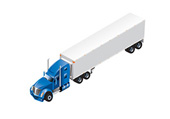 |
| R002 | Licence | **What must a G1 driver do while driving?** | Carry a valid licence and be accompanied by a fully licensed driver with at least four years of driving experience, seated in the front passenger seat.  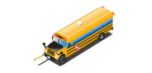 |
| R003 | Licence | **What blood-alcohol rules apply to a G1 driver?** | A G1 driver must have a blood-alcohol level of zero and must not have cannabis in their system, subject to limited medical-cannabis exceptions.  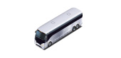 |
| R004 | Licence | **When may a G1 driver not drive?** | Between midnight and 5 a.m., and on 400-series highways or other high-speed expressways unless accompanied by an Ontario-certified driving instructor.  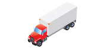 |
| R005 | Licence | **Who may sit in the front seat beside a G1 driver?** | Only the qualified accompanying driver; every occupant must have a working seatbelt.  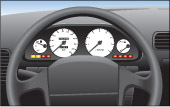 |
| R006 | Licence | **How long must you normally hold G1 before taking the G1 exit test?** | 12 months, or 8 months after successfully completing an approved beginner driver-education course.  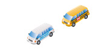 |
| R007 | Readiness | **What should you do before entering your vehicle?** | Walk around it, check for children, pedestrians, obstacles, leaking fluids, and damaged or under-inflated tires.  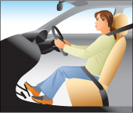 |
| R008 | Readiness | **How should the driver's seat be positioned?** | Sit upright with clear visibility, able to reach pedals and controls comfortably; keep at least about 25 cm from the steering wheel where possible.  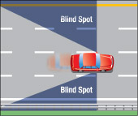 |
| R009 | Readiness | **How should the head restraint be adjusted?** | The top should be level with the top of your head and as close to the back of your head as possible.  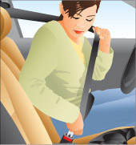 |
| R010 | Readiness | **What is the safest way to check a blind spot?** | Turn your head and glance over your shoulder in the direction you plan to move; mirrors alone do not show blind spots.  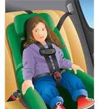 |
| R011 | Seatbelts | **Who is responsible for passengers under age 16 wearing seatbelts?** | The driver is responsible for ensuring passengers under 16 are properly secured.  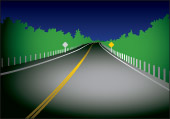 |
| R012 | Seatbelts | **How should a seatbelt fit?** | The lap belt should sit low and snug across the hips, and the shoulder belt across the chest and shoulder, never under the arm or behind the back.  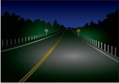 |
| R013 | Child safety | **When is a rear-facing child seat required?** | For an infant under 9 kg; follow the seat manufacturer's limits and install it in the rear seat, away from an active airbag.   |
| R014 | Child safety | **When is a booster seat required?** | For a child under age eight who weighs 18–36 kg and is under 145 cm tall, unless a legal exemption applies.   |
| R015 | Lights | **When must headlights be on?** | From half an hour before sunset until half an hour after sunrise, and whenever poor light or weather prevents clearly seeing people or vehicles 150 m away.   |
| R016 | Lights | **When must high beams be dimmed?** | Within 150 m of an oncoming vehicle and within 60 m when following another vehicle.   |
| R017 | Signals | **How far before a turn should you signal?** | Signal early enough to warn other road users; in business or residential areas, at least about 30 m before the turn is a useful guide.  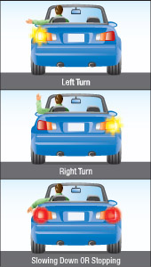 |
| R018 | Signals | **What are the hand signals for left, right, and stop?** | Left: left arm straight out. Right: left arm bent upward. Slow/stop: left arm bent downward.  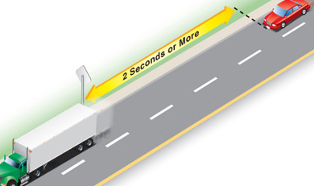 |
| R019 | Following | **What is the minimum following-distance rule in good conditions?** | Keep at least a two-to-three-second gap; increase it in poor weather, darkness, heavy traffic, or when behind large vehicles.   |
| R020 | Following | **How do you measure a two-to-three-second following gap?** | When the vehicle ahead passes a fixed object, count seconds until your vehicle reaches the same object.   |
| R021 | Speed | **What does a posted speed limit mean?** | It is the maximum legal speed in ideal conditions, not a target; drive slower when road, traffic, visibility, or weather conditions require it.   |
| R022 | Speed | **What are typical maximum speeds where no sign is posted?** | Generally 50 km/h in cities, towns and villages, and 80 km/h elsewhere, unless signs or law provide otherwise.   |
| R023 | Scanning | **How far ahead should you look in city driving?** | Look at least 12–15 seconds ahead while also checking mirrors and nearby hazards.   |
| R024 | Intersections | **Who has the right-of-way at an uncontrolled intersection?** | If two vehicles arrive together, the driver on the left must yield to the driver on the right.   |
| R025 | Intersections | **What must a driver turning left do?** | Signal, enter the proper lane, and yield to oncoming traffic and pedestrians before turning when safe.   |
| R026 | Intersections | **Who has priority when entering from a private road or driveway?** | Traffic and pedestrians on the through road have priority; stop before the sidewalk and yield until clear.  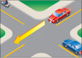 |
| R027 | Intersections | **What does right-of-way mean?** | It determines who must yield; never assume it is safe merely because you have priority—avoid a collision whenever possible.  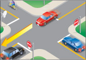 |
| R028 | Traffic lights | **What does a steady red light require?** | Come to a complete stop at the stop line, crosswalk, or edge of the intersection and remain stopped until permitted to proceed.  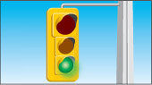 |
| R029 | Traffic lights | **When may you turn right on a red light?** | After a complete stop, unless a sign prohibits it, and only after yielding to pedestrians and all traffic with the right-of-way.  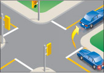 |
| R030 | Traffic lights | **When may you turn left on red?** | Only from a one-way road onto another one-way road, after stopping and yielding, unless a sign prohibits it.  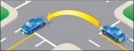 |
| R031 | Traffic lights | **What does a steady amber light mean?** | The light is changing to red. Stop if you can do so safely; otherwise proceed with caution through the intersection.  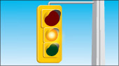 |
| R032 | Traffic lights | **What does a flashing red light mean?** | Treat it like a stop sign: stop completely and proceed only when safe.  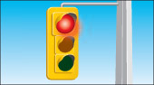 |
| R033 | Traffic lights | **What does a flashing amber light mean?** | Slow down and proceed with caution.  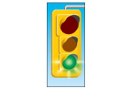 |
| R034 | Traffic lights | **What does a green light permit?** | Proceed straight or turn when the way is clear, while yielding to pedestrians and vehicles already in the intersection.  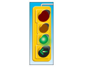 |
| R035 | Traffic lights | **What does a green arrow mean?** | You may move only in the arrow's direction, after yielding to pedestrians and any traffic lawfully in the intersection.  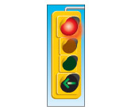 |
| R036 | Traffic lights | **What should you do if traffic lights are not working?** | Treat the intersection as an all-way stop, proceed in turn, and use extreme caution.  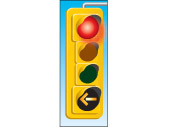 |
| R037 | Stops | **Where must you stop at a stop sign?** | At the stop line; if none, before the crosswalk; if none, at the edge of the sidewalk; if none, at the edge of the intersection.  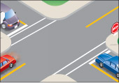 |
| R038 | Stops | **What is a complete stop?** | The vehicle's wheels must stop moving entirely before you proceed.  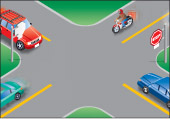 |
| R039 | All-way stop | **Who goes first at an all-way stop?** | The first vehicle to stop goes first. If vehicles stop together, the driver on the left yields to the driver on the right.  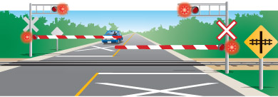 |
| R040 | School bus | **When must drivers stop for a school bus with red lights flashing?** | Approaching from either direction on an undivided road, stop at least 20 m away. On a divided road, only traffic behind the bus must stop.  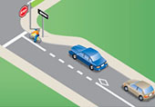 |
| R041 | School bus | **When may you pass a stopped school bus displaying red lights?** | Only after the bus moves, the red lights stop flashing, or the stop arm is no longer activated.  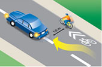 |
| R042 | Streetcar | **How must you pass a streetcar?** | Pass on the right, unless on a one-way road; never pass on the left when doing so would put you into oncoming traffic.  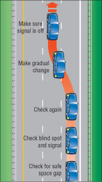 |
| R043 | Streetcar | **Where must you stop behind a streetcar taking on or discharging passengers?** | At least 2 m behind its rear doors, unless there is a passenger safety island; proceed only after passengers are safely clear.  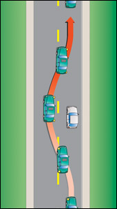 |
| R044 | Pedestrians | **What must you do at a pedestrian crossover?** | Stop before the crossover and yield the entire roadway until the pedestrian and school crossing guard are safely on the sidewalk.  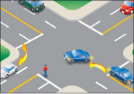 |
| R045 | Pedestrians | **What must you do for a school crossing guard displaying a stop sign?** | Stop before reaching the crossing and remain stopped until everyone, including the guard, is safely off the roadway.  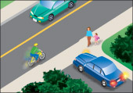 |
| R046 | Cyclists | **How much space must you leave when passing a cyclist?** | Leave at least 1 m where practical; change lanes when possible and pass only when safe.  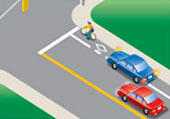 |
| R047 | Cyclists | **What should you check before opening a vehicle door?** | Check mirrors and your blind spot for cyclists and traffic; use the far hand if helpful to force a shoulder check.  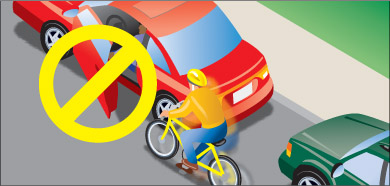 |
| R048 | Motorcycles | **Why must you give motorcycles a full lane?** | They are entitled to the lane and need room to avoid hazards; never share their lane or pass too closely.  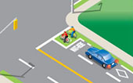 |
| R049 | Large vehicles | **Why should you avoid a truck's blind spots?** | If you cannot see the truck driver's face in the mirror, the driver likely cannot see you; do not linger beside or directly behind.  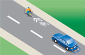 |
| R050 | Large vehicles | **Why should you leave extra room behind a large truck?** | It blocks your view, needs more stopping room, and may roll backward when starting on a hill.  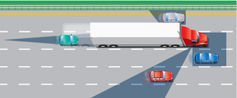 |
| R051 | Emergency vehicles | **What must you do when an emergency vehicle approaches with lights or siren?** | Safely pull as close as practical to the right edge, clear of intersections, and stop until it has passed.  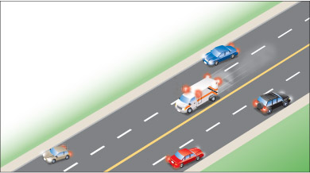 |
| R052 | Emergency vehicles | **What is required when passing a stopped emergency vehicle or tow truck with flashing lights?** | Slow down and pass cautiously; on a multi-lane road, move to a lane not adjacent to it when safe.  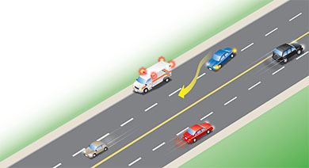 |
| R053 | Turns | **How do you make a right turn correctly?** | Signal, check mirrors and blind spot, approach in the rightmost lane, yield, and finish in the rightmost available lane unless markings direct otherwise.  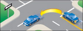 |
| R054 | Turns | **How do you make a left turn from a two-way road?** | Approach just right of the centre line, yield, turn left of the intersection centre, and enter the first available lane right of the centre line.  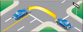 |
| R055 | Turns | **When is a U-turn prohibited?** | On a curve, near a hilltop, near a railway crossing, where visibility is limited, or wherever a sign prohibits it.  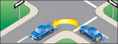 |
| R056 | Backing | **What is the key rule when reversing?** | Check all around, look mainly through the rear window in the direction of travel, reverse slowly, and yield to all traffic and pedestrians.  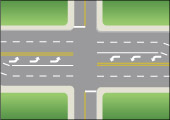 |
| R057 | Lane changes | **What sequence should you use to change lanes?** | Check mirrors, signal, check the blind spot, ensure a safe gap, move smoothly, and cancel the signal.  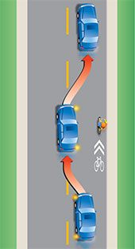 |
| R058 | Passing | **When must you not pass?** | When visibility or space is insufficient, near curves or hilltops, at or near crossings, or where signs or solid-line conditions prohibit unsafe passing.  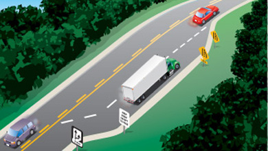 |
| R059 | Passing | **What should you do when another vehicle is passing you?** | Keep right, maintain or reduce speed if necessary, and do not accelerate until the vehicle has safely returned.  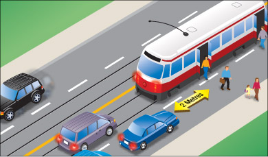 |
| R060 | Parking | **How close may you park to a fire hydrant?** | At least 3 m away.  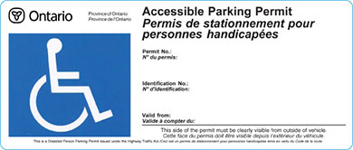 |
| R061 | Parking | **How close may you park to an intersection without traffic lights?** | At least 9 m away; keep at least 15 m from an intersection controlled by traffic lights.  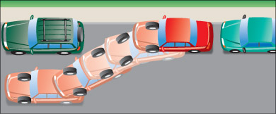 |
| R062 | Parking | **How should wheels be turned when parking downhill with a curb?** | Turn the front wheels toward the curb and set the parking brake.   |
| R063 | Parking | **How should wheels be turned when parking uphill with a curb?** | Turn the front wheels left, away from the curb, so the vehicle would roll back into the curb; set the parking brake.   |
| R064 | Parking | **How should wheels be turned on a hill with no curb?** | Turn the wheels toward the edge of the road so the vehicle rolls away from traffic if it moves.   |
| R065 | Freeways | **How should you enter a freeway?** | Use the acceleration lane to reach traffic speed, signal, find a safe gap, check the blind spot, and merge smoothly without stopping unless necessary.   |
| R066 | Freeways | **What should you do if you miss a freeway exit?** | Continue to the next exit; never stop, reverse, or cross the median.   |
| R067 | Freeways | **How should you leave a freeway?** | Signal, move into the exit lane early, and reduce speed in the deceleration lane—not in the through lane.   |
| R068 | Freeways | **Which lane should normally be used for driving?** | Keep to the right; use left lanes for passing or when traffic and signs require it.   |
| R069 | Roundabouts | **Who has the right-of-way at a roundabout?** | Traffic already in the roundabout; yield at entry, choose the correct lane before entering, and signal right when exiting.   |
| R070 | Railways | **What should you do at a railway crossing with flashing signals or a lowered gate?** | Stop at least 5 m from the nearest rail and do not proceed until signals stop, the gate rises, and the way is clear.   |
| R071 | Railways | **What if your vehicle stalls on railway tracks?** | Get everyone out immediately, move well away in the direction from which the train is approaching, and call 911 or the crossing emergency number. |
| R072 | Night | **How do you avoid overdriving your headlights?** | Drive slowly enough that you can stop within the distance illuminated by your headlights.   |
| R073 | Night | **Where should you look when dazzled by oncoming headlights?** | Look slightly down and to the right edge of your lane; slow down and avoid staring at the lights.   |
| R074 | Fog | **Which lights should be used in fog?** | Use low-beam headlights; high beams reflect off fog and reduce visibility.   |
| R075 | Rain | **What should you do if the vehicle hydroplanes?** | Ease off the accelerator, steer straight, avoid hard braking, and wait for the tires to regain traction.   |
| R076 | Skid | **How do you recover from a skid?** | Ease off the accelerator or brake, look and steer where you want to go, and avoid over-correcting. |
| R077 | Brake failure | **What should you do if the brakes fail?** | Pump the brake pedal, downshift, apply the parking brake gradually, steer to a safe place, and use warning devices. |
| R078 | Tire blowout | **What should you do after a tire blowout?** | Grip the wheel firmly, ease off the accelerator, avoid hard braking, let the vehicle slow, and steer off the road safely. |
| R079 | Collision | **When must a collision be reported to police?** | When anyone is injured or killed, total apparent property damage exceeds the legal reporting threshold, or the law otherwise requires it. |
| R080 | Collision | **What must a driver do after a collision?** | Stop, remain or return to the scene, help injured people, call emergency services when needed, exchange information, and report when required. |
| R081 | Animals | **What should you do if an animal appears on the road?** | Slow down, stay in control, avoid a violent swerve, and brake firmly if safe; be especially alert at dawn and dusk.   |
| R082 | Construction | **How should you drive in a construction zone?** | Obey signs and traffic-control workers, reduce speed, increase following distance, keep out of closed lanes, and watch for workers and equipment.   |
| R083 | Distracted driving | **What devices may a driver not hold or use while driving?** | A hand-held wireless communication or entertainment device, and a display screen unrelated to driving, except as specifically permitted by law.   |
| R084 | Impairment | **What is the safest rule about alcohol, cannabis, drugs, and driving?** | Never drive impaired; arrange a sober ride and remember that prescription and over-the-counter drugs can also impair driving. |
| R085 | Demerit points | **How many points can result from failing to stop for a school bus?** | Six demerit points.   |
| R086 | Demerit points | **How many points can result from failing to stop at a pedestrian crossover?** | Four demerit points.   |
| R087 | Demerit points | **How many points can result from failing to obey a stop sign or traffic light?** | Three demerit points.   |
| R088 | Vehicle | **What should you check regularly on tires?** | Pressure, tread depth, cuts, cracks, bulges, uneven wear, and embedded objects; check pressure when tires are cold.   |
| R089 | Vehicle | **What is the minimum legal tire tread depth?** | At least 1.5 mm, though replacing tires before reaching the legal minimum is safer.   |
| R090 | Vehicle | **What must you do when an oncoming driver fails to dim high beams?** | Slow down, keep your eyes toward the right edge of your lane, and do not retaliate with your high beams.   |
| R091 | Licensing | **How long may a new Ontario resident use an existing out-of-province licence?** | For 60 days after becoming an Ontario resident; within that period, apply for an Ontario licence. |
| R092 | Licensing | **When does a visitor to Ontario need an international driving permit?** | When visiting for more than three months; it must be issued by the visitor's home country. |
| R093 | Licensing | **What tests begin Ontario's graduated licensing process?** | A vision test and a knowledge test covering rules of the road and traffic signs. |
| R094 | Licensing | **How long does the two-step graduated licensing process normally take at minimum?** | At least 20 months from G1 through full G licensing. |
| R095 | G1 | **What BAC limit applies to the qualified accompanying driver?** | Less than 0.05 percent while accompanying the G1 driver. |
| R096 | G1 | **Does valid G2 experience count toward an accompanying driver's four years of experience?** | Yes, provided the G2 licence was valid and not suspended during that time. |
| R097 | G1 | **May the qualified accompanying driver have demerit points?** | Yes, but their licence cannot be suspended. |
| R098 | G1 | **When may a G1 driver use a prohibited high-speed road?** | When accompanied by an Ontario-certified driving instructor. |
| R099 | G2 | **What nighttime passenger restriction applies during the first six months to a G2 driver age 19 or under?** | Between midnight and 5 a.m., only one passenger age 19 or under is allowed. |
| R100 | G2 | **What nighttime passenger restriction applies after the first six months to a G2 driver age 19 or under?** | Between midnight and 5 a.m., up to three passengers age 19 or under are allowed until the driver earns a full G licence or turns 20. |
| R101 | G2 | **When do the young G2 nighttime passenger limits not apply?** | When a fully licensed driver is in the front passenger seat or the young passengers are immediate family members. |
| R102 | Licensing | **Who must have a zero blood-alcohol level regardless of licence class?** | Every driver age 21 or under, as well as novice drivers subject to zero-BAC conditions. |
| R103 | Licensing | **What must a licensed driver do after developing a medical condition that may affect safe driving?** | Report the change; doctors and optometrists also have legal reporting duties for relevant conditions. |
| R104 | Licensing | **May you hold an Ontario Photo Card and an Ontario driver's licence at the same time?** | No; the Photo Card must be surrendered when applying for a driver's licence. |
| R105 | Readiness | **What should you check around a vehicle before getting in?** | Children, pedestrians, obstacles, fresh damage, leaks, tire condition, unsecured loads, and doors, hood or trunk left ajar. |
| R106 | Readiness | **Why should loose objects be secured inside a vehicle?** | They can interfere with controls or become dangerous projectiles in sudden braking or a collision. |
| R107 | Readiness | **What should dashboard warning lights do when the engine starts?** | They normally illuminate for a system check and then go out; a light that remains on needs attention. |
| R108 | Readiness | **How often should mirrors generally be checked while driving?** | About every five seconds, while continuing to scan ahead and check blind spots when manoeuvring. |
| R109 | Readiness | **Where should hands normally be placed on the steering wheel?** | At approximately the nine-o'clock and three-o'clock positions. |
| R110 | Readiness | **What should you do if visibility is blocked by snow, ice, dirt, stickers or objects?** | Clear the windshield, windows, mirrors and lights before driving; keep the view unobstructed. |
| R111 | Seatbelts | **May two people share one seatbelt?** | No; each occupant must use a separate working seatbelt and designated seating position. |
| R112 | Seatbelts | **Why should the seat be kept well back from an airbag?** | To reduce airbag injury while still allowing full control; about 25 cm from the steering wheel is recommended where possible. |
| R113 | Child safety | **Where is the safest place for a child restraint?** | Properly installed in the rear seat, following the restraint and vehicle manufacturers' instructions. |
| R114 | Lights | **Are daytime running lights enough at night or in poor visibility?** | No; turn on the full headlight system so headlights, tail lights and instrument lights operate. |
| R115 | Driving | **Is signalling enough to make a turn or lane change safe?** | No; signal early, check mirrors and blind spots, yield as required, and move only when the way is clear. |
| R116 | Driving | **When should brake lights and turn signals be used?** | Before stopping, slowing, turning, changing lanes, leaving the road or pulling out from a parked position. |
| R117 | Driving | **What should you do if turn signals or brake lights do not work?** | Use the correct hand-and-arm signals and repair the vehicle lights promptly. |
| R118 | Driving | **When should cruise control not be used?** | On wet, icy or slippery roads, in heavy traffic, or when tired or conditions require frequent speed changes. |
| R119 | Police | **Whose directions take priority when a police officer is directing traffic?** | The officer's directions, even when they differ from traffic lights or signs. |
| R120 | Police | **What should you do when police signal you to pull over?** | Pull safely as far right as practical, stop completely, remain in the vehicle and wait for instructions. |
| R121 | Police | **Which documents must be surrendered immediately when requested by police?** | Your driver's licence, vehicle permit or copy, and proof of insurance; there is no 24-hour grace period. |
| R122 | Traffic flow | **May you drive unnecessarily slowly?** | No; do not block the normal and reasonable movement of traffic, while still obeying limits and driving for conditions. |
| R123 | Pedestrians | **Are all intersection crosswalks painted or signed?** | No; nearly every intersection has crosswalks even when they are unmarked. |
| R124 | Pedestrians | **May you pass a vehicle stopped at a crosswalk?** | No; it may be stopped for a pedestrian you cannot see. |
| R125 | Pedestrians | **When may drivers proceed at a pedestrian crossover or school crossing with a guard?** | Only after pedestrians and the crossing guard have cleared the entire roadway and are safely on the sidewalk. |
| R126 | Pedestrians | **How are people using motorized wheelchairs or medical scooters treated?** | As pedestrians; give them the same right-of-way, patience and protection. |
| R127 | Pedestrians | **Why must hybrid and electric vehicle drivers use extra care near vision-impaired pedestrians?** | These vehicles may be too quiet for pedestrians who rely partly on engine sound. |
| R128 | Cyclists | **What minimum passing distance should a motor vehicle leave from a cyclist where practical?** | At least one metre; change lanes to pass whenever possible. |
| R129 | Cyclists | **When may cyclists use more of a traffic lane instead of staying near the right edge?** | To avoid hazards, cross tracks safely, discourage unsafe passing, turn left, or travel at normal traffic speed. |
| R130 | Cyclists | **What must a driver do before turning right across a bike lane?** | Signal, check mirrors and the right blind spot, yield to cyclists, enter the bike lane only when safe, then turn. |
| R131 | Cyclists | **Where must a driver stop at a red light when a bike box is present?** | Behind the bike box; never stop inside the marked box. |
| R132 | Cyclists | **What does a bicycle sharrow mean?** | The lane is shared by bicycles and motor vehicles; watch for cyclists using the lane. |
| R133 | Cyclists | **Should a driver sound the horn while close behind a cyclist?** | No; if a warning is necessary, use a brief light tap while still well back so the cyclist is not startled. |
| R134 | Cyclists | **Why should you leave extra following distance behind a cyclist?** | Cyclists can slow or stop quickly and do not have brake lights to warn following drivers. |
| R135 | Motorcycles | **How much of a lane may a motorcycle use?** | A full lane; treat it as another vehicle and do not crowd it. |
| R136 | Motorcycles | **Why should you not rely only on a motorcycle's flashing turn signal?** | Many motorcycle signals do not cancel automatically; confirm that the rider is actually turning. |
| R137 | Large vehicles | **What does it mean if you cannot see a truck driver's face in the truck's mirror?** | The truck driver likely cannot see you; move out of the truck's blind spot. |
| R138 | Large vehicles | **Why must you avoid cutting closely in front of a large vehicle?** | Large vehicles need much more stopping distance, and cutting in removes their safety cushion. |
| R139 | Large vehicles | **Why must you stay out of the open space beside a truck making a wide turn?** | The trailer will track back toward the curb and can squeeze a vehicle caught beside it. |
| R140 | Large vehicles | **Why should you leave extra space behind a large vehicle stopped uphill?** | It may roll backward when the driver releases the brakes. |
| R141 | Large vehicles | **What hazards can a large vehicle create when you pass it?** | Spray, debris and air turbulence that can reduce visibility or disturb steering control. |
| R142 | Municipal buses | **What must you do when a bus signals to leave a bus bay?** | Yield and allow it to re-enter traffic when you are approaching in the adjacent lane. |
| R143 | Farm machinery | **How should you respond to farm machinery displaying a slow-moving-vehicle sign?** | Slow down, stay well back and pass only when it is legal and safe; the vehicle travels at 40 km/h or less. |
| R144 | Horse-drawn vehicles | **How should you drive near a horse-drawn vehicle?** | Slow down, leave a safe following distance, pass cautiously with ample room and avoid frightening the horse. |
| R145 | Intersections | **What makes an intersection controlled?** | Traffic lights, signs or a traffic-control person regulate who proceeds. |
| R146 | Intersections | **What should you do when approaching an uncontrolled intersection?** | Slow down, cover the brake, look left-right-left, yield as required and proceed only when clear. |
| R147 | Intersections | **Who yields when two vehicles reach an uncontrolled intersection at different times?** | The driver arriving last yields to the vehicle already there. |
| R148 | Intersections | **Does having the legal right-of-way guarantee that it is safe to proceed?** | No; never force the right-of-way, and take every reasonable action to avoid a collision. |
| R149 | Intersections | **What must a driver do when emerging from an alley, driveway or private road across a sidewalk?** | Stop before the sidewalk, yield to pedestrians, then yield to road traffic before entering. |
| R150 | Stopping | **What should you do before stopping unexpectedly or where following traffic may not anticipate it?** | Check mirrors, signal or tap brake lights when appropriate, and stop smoothly in a safe position. |
| R151 | Railways | **Which vehicles must stop at all unprotected railway crossings?** | School buses and other buses carrying passengers, plus vehicles carrying dangerous materials as required by law. |
| R152 | Railways | **May you drive around, under or through a lowered railway gate?** | Never; wait until the gate is fully raised, signals stop and every track is clear. |
| R153 | Railways | **How far from the nearest rail should you stop when railway signals require it?** | At least five metres away. |
| R154 | School crossings | **What must drivers do when a school crossing guard displays a stop sign?** | Stop before reaching the crossing and remain stopped until everyone, including the guard, has cleared the roadway. |
| R155 | Pedestrian crossovers | **May a driver proceed as soon as a pedestrian passes the vehicle's lane?** | No; wait until the pedestrian has completely crossed the roadway. |
| R156 | Turns | **Where should a right turn normally begin and end?** | From the rightmost lane into the rightmost available lane, unless signs or markings direct otherwise. |
| R157 | Turns | **What must you check immediately before a right turn?** | Mirrors, the right blind spot, pedestrians and cyclists along the curb or bike lane. |
| R158 | Turns | **How should a left turn from a one-way road onto a one-way road be made?** | From the leftmost lane into the leftmost available lane after yielding. |
| R159 | Turns | **May a left turn on red be made from a two-way road?** | No; left on red is allowed only from a one-way road to another one-way road, unless prohibited. |
| R160 | Turns | **How should two opposing vehicles both turning left pass each other?** | Turn left of centre so the vehicles pass right side to right side, unless markings direct otherwise. |
| R161 | Roundabouts | **When should you choose your lane for a roundabout?** | Before entering, based on the intended exit and posted lane-use signs; avoid changing lanes inside. |
| R162 | Roundabouts | **Which direction does traffic move in an Ontario roundabout?** | Counter-clockwise around the centre island. |
| R163 | Roundabouts | **Should you stop inside a roundabout to let another vehicle enter?** | No, unless required to avoid a collision or obey traffic control; entering traffic must yield. |
| R164 | Roundabouts | **How should you handle an emergency vehicle while in a roundabout?** | Continue to your exit, leave the roundabout, then pull over safely; do not stop in the roundabout. |
| R165 | Backing | **Where should you look while backing straight?** | Turn your body and look mainly through the rear window while checking all around and moving slowly. |
| R166 | Backing | **May you rely only on a backup camera?** | No; use direct observation, mirrors and shoulder checks because cameras have blind areas. |
| R167 | U-turns | **What visibility is required before making a U-turn?** | You must be able to see far enough in both directions to turn without interfering with traffic. |
| R168 | Three-point turns | **Where should a three-point turn be avoided?** | On curves, near hilltops, near railway crossings, on busy roads, or anywhere visibility or space is inadequate. |
| R169 | Lane changes | **Should speed normally change sharply during a lane change?** | No; maintain a steady appropriate speed and move smoothly after confirming a safe gap. |
| R170 | Lane changes | **May you change lanes inside or close to an intersection?** | Avoid doing so; intersections contain conflicts and lane changes there can be unsafe or illegal. |
| R171 | Passing | **What must you confirm before passing on a two-lane road?** | The pass is legal, the road ahead is clear far enough, no vehicle is passing you, and you can return without forcing others to brake. |
| R172 | Passing | **How should you return to your lane after passing?** | Signal and return only after you can see the entire front of the passed vehicle in your inside mirror. |
| R173 | Passing | **May you exceed the speed limit while passing?** | No; the speed limit continues to apply. |
| R174 | Passing | **When may passing on the right be permitted?** | On a multi-lane road or when the vehicle ahead is turning left and there is a lawful paved lane; never use the shoulder. |
| R175 | Passing | **May the paved shoulder be used as a regular passing lane?** | No, except where signs or lawful lane markings specifically permit travel. |
| R176 | Passing | **Why is passing at night more difficult?** | Distance and speed are harder to judge and the road beyond the headlights may hide hazards. |
| R177 | Climbing lanes | **Who should use a climbing or truck lane?** | Slower vehicles should move into it so faster traffic can pass safely. |
| R178 | Streetcars | **When may you pass a streetcar on the left?** | On a one-way road when safe and permitted; otherwise pass on the right. |
| R179 | Parking | **How close must you park to the curb where curb parking is permitted?** | As close as practical, generally no more than about 30 cm from the curb. |
| R180 | Parking | **How far must parking be kept from a pedestrian crossover?** | At least 15 metres away. |
| R181 | Parking | **How far must parking be kept from a railway crossing?** | At least 15 metres from the nearest rail. |
| R182 | Parking | **May you park on a bridge, in a tunnel or where your vehicle blocks traffic or visibility?** | No. |
| R183 | Parking | **May you park in front of a driveway or fire station entrance?** | No; keep entrances and emergency access clear and obey required posted distances. |
| R184 | Accessible parking | **Who may use an accessible parking space?** | A vehicle displaying a valid accessible parking permit while transporting the person to whom the permit applies. |
| R185 | Parallel parking | **What is the basic final position after parallel parking?** | Centred in the space, close and parallel to the curb, with enough room for nearby vehicles to leave. |
| R186 | Hill parking | **Besides turning the wheels, what must always be done when parking on a hill?** | Set the parking brake, select park or an appropriate gear, and ensure the vehicle cannot roll. |
| R187 | Roadside stop | **What checks are required before pulling away from a roadside stop?** | Signal, check mirrors, check the blind spot and yield until there is a safe gap. |
| R188 | Freeways | **Which road users are generally prohibited from freeways?** | Pedestrians, bicycles, limited-speed vehicles and others unable or unauthorized to maintain freeway operation. |
| R189 | Freeways | **Should you stop at the end of an acceleration lane?** | Avoid stopping unless absolutely necessary; use the lane to match traffic speed and merge into a safe gap. |
| R190 | Freeways | **Who has the right-of-way when you merge onto a freeway?** | Traffic already on the freeway; the entering driver must find a safe gap. |
| R191 | Freeways | **What should freeway drivers do when another vehicle is entering?** | Maintain awareness and, when safe, adjust speed or change lanes to help create space without making a dangerous move. |
| R192 | Freeways | **Why must speed be checked after leaving a freeway?** | Freeway speed can make a lower road speed feel unusually slow, leading to unintentional speeding. |
| R193 | Freeways | **What should you do before reaching your freeway exit?** | Check mirrors, signal early and move into the correct exit lane without last-second crossing. |
| R194 | HOV lanes | **Who may use a provincial HOV lane?** | Vehicles meeting the posted occupancy requirement and specifically permitted vehicles such as buses, motorcycles, taxis and authorized vehicles. |
| R195 | HOV lanes | **May you cross the striped buffer anywhere to enter or leave an HOV lane?** | No; enter and exit only at designated broken-line openings. |
| R196 | Aggressive driving | **What should you do when confronted by an aggressive driver?** | Stay calm, avoid eye contact or retaliation, create distance, let the driver pass and call police from a safe place if necessary. |
| R197 | Road rage | **Should you go home while an aggressive driver is following you?** | No; drive to a police station or busy public place and call for help. |
| R198 | Street racing | **Is racing or performing driving stunts on a public road legal?** | No; street racing and stunt driving carry severe roadside and court sanctions. |
| R199 | Fatigue | **What are common warning signs of drowsy driving?** | Frequent yawning, heavy eyes, wandering thoughts, missed signs, lane drifting and difficulty remembering recent kilometres. |
| R200 | Fatigue | **What is the only reliable response to serious driver fatigue?** | Stop in a safe place and rest or change drivers; opening a window or turning up music is not a substitute. |
| R201 | Construction | **Whose directions must be obeyed in a work zone?** | Police, traffic-control persons and firefighters, along with temporary signs and signals. |
| R202 | Construction | **Why should following distance be increased in work zones?** | Traffic may stop suddenly and lanes, surfaces, workers or equipment may create unexpected hazards. |
| R203 | Distracted driving | **May a hand-held phone be used while stopped at a red light?** | No; you are still driving. Pull off the roadway and park safely before handling it, except for a lawful emergency call. |
| R204 | Distracted driving | **When may a hand-held device be used to call 911?** | In a genuine emergency when it is not practical or safe to pull over first. |
| R205 | Distracted driving | **May you manually program a GPS while driving?** | No; program it before driving or use permitted voice commands or a passenger. |
| R206 | Careless driving | **Can eating, grooming, reading or other distractions lead to careless-driving charges?** | Yes, when they cause driving without due care, attention or reasonable consideration for others. |
| R207 | Emergency vehicles | **What must you do before pulling over for an approaching emergency vehicle?** | Check around you, signal, move safely to the right and stop clear of intersections; do not make an unsafe sudden move. |
| R208 | Emergency vehicles | **May you follow closely behind an emergency vehicle responding to a call?** | No; stay at least 150 metres behind a fire vehicle responding to an alarm. |
| R209 | Move over | **What is the move-over rule on a road with two or more lanes in your direction?** | Slow down and, when safe, move to a lane not adjacent to the stopped emergency vehicle or tow truck displaying flashing lights. |
| R210 | Move over | **What if changing lanes is unsafe when passing a stopped emergency vehicle or tow truck?** | Slow down significantly, pass with caution and be prepared to stop. |
| R211 | Night driving | **What does it mean to overdrive your headlights?** | Your stopping distance is longer than the distance you can see ahead with the headlights. |
| R212 | Glare | **What should you do when entering a tunnel from bright daylight?** | Slow down, remove sunglasses, turn on headlights and allow your eyes time to adjust. |
| R213 | Glare | **How can glare from a following vehicle be reduced at night?** | Adjust the rear-view mirror to its night setting and avoid staring into bright reflections. |
| R214 | Fog | **What should you do if fog becomes too dense to drive safely?** | Pull completely off the road into a safe place, turn on emergency flashers and wait for visibility to improve. |
| R215 | Fog | **Should cruise control be used in fog?** | No; maintain direct control of speed and be ready to respond immediately. |
| R216 | Rain | **When are roads often most slippery during rainfall?** | Near the beginning of rain, when water mixes with oil and dirt on the road. |
| R217 | Rain | **How should following distance change in rain?** | Increase it substantially and reduce speed to allow for longer stopping distance. |
| R218 | Flooding | **Should you drive through a flooded roadway when the depth or road condition is uncertain?** | No; turn around and use another route because water can hide washouts or move the vehicle. |
| R219 | Skids | **Where should you look and steer during a skid?** | Look and steer in the direction you want the vehicle to travel, while easing off the accelerator or brake. |
| R220 | ABS | **How should anti-lock brakes normally be used in an emergency stop?** | Press the brake firmly and continuously while steering; do not pump the pedal. |
| R221 | Braking | **What is threshold braking without ABS?** | Braking as firmly as possible without locking the wheels, easing slightly if they lock, then reapplying. |
| R222 | Snow | **Why should speed be reduced before a curve on snow or ice?** | Braking or making abrupt changes inside the curve can break traction and cause a skid. |
| R223 | Whiteouts | **What should you do when a whiteout makes continued driving unsafe?** | Leave the roadway at the nearest safe place; if stranded, remain with the vehicle and use emergency signals. |
| R224 | Snow plows | **Why must you stay well behind a working snow plow?** | Blowing snow can hide the plow, the road and oncoming traffic, and the plow may create a ridge or throw debris. |
| R225 | Snow plows | **Is it safe to pass between snow plows operating in echelon formation?** | No; never pass between or through a group of plows clearing multiple lanes. |
| R226 | Emergency | **What should you do if the accelerator sticks?** | Try to lift it, shift to neutral, brake, steer to a safe place and turn off the engine only after control is secure. |
| R227 | Emergency | **What should you do if the headlights suddenly fail at night?** | Try the switch and high beams, activate hazard lights, slow down and pull safely off the road. |
| R228 | Emergency | **How should you recover when wheels drop off the pavement?** | Grip the wheel, ease off the accelerator, avoid hard braking, slow down, then return gently when the way is clear. |
| R229 | Emergency | **What should you do if the vehicle breaks down on a freeway?** | Move as far off the roadway as possible, activate hazard lights, stay visible and seek help from a safe location. |
| R230 | Collision | **What information should drivers exchange after a collision?** | Names, addresses, phone numbers, licence and plate numbers, insurance information and vehicle-owner details. |
| R231 | Collision | **Should an injured person be moved after a collision?** | Not unless there is immediate danger; call emergency services and provide reasonable assistance. |
| R232 | Collision | **What evidence should be collected when safe after a collision?** | Photos, witness information, vehicle positions, damage, road conditions and the other parties' documents. |
| R233 | Traffic lights | **What does an advance green arrow permit?** | Movement only in the arrow's direction after yielding to pedestrians and any traffic lawfully in the intersection. |
| R234 | Traffic lights | **What does a fully protected left-turn signal mean?** | Left turns are controlled by their own arrow; turn only while the permitted arrow is displayed. |
| R235 | Traffic lights | **What does a transit-priority signal mean to ordinary drivers?** | It is for transit vehicles; other drivers follow their regular traffic signal. |
| R236 | Traffic lights | **How should a blank or completely dark traffic signal be treated?** | As an all-way stop: stop, yield and proceed in turn only when safe. |
| R237 | Traffic beacons | **What does a flashing red beacon require?** | A complete stop followed by proceeding only when safe. |
| R238 | Traffic beacons | **What does a flashing yellow beacon require?** | Slow down and proceed with caution. |
| R239 | Pedestrian signals | **What does a steady walking-person symbol mean?** | Pedestrians may begin crossing after checking that vehicles have yielded. |
| R240 | Pedestrian signals | **What does a flashing hand or countdown mean to a pedestrian who has not started crossing?** | Do not begin crossing; pedestrians already in the roadway should finish safely. |
| R241 | Pavement markings | **What does a solid yellow line generally separate?** | Opposing traffic and a location where passing may be unsafe or restricted. |
| R242 | Pavement markings | **What does a broken yellow line generally permit?** | Passing opposing traffic when the way is clear and it is otherwise legal. |
| R243 | Pavement markings | **What do white lane lines separate?** | Traffic moving in the same direction. |
| R244 | Pavement markings | **What does a solid white line between lanes indicate?** | Lane changing is discouraged or restricted because conditions require extra caution. |
| R245 | Pavement markings | **What is a painted island or hatched area for?** | It separates traffic or protects a space; do not drive, stop or park in it unless directed. |
| R246 | Pavement markings | **What do two white parallel double lines mark?** | A pedestrian crossover where drivers must stop and yield the whole roadway. |
| R247 | Licence laws | **Is it legal to lend your driver's licence or let another person use it?** | No; you may not lend, alter, duplicate, imitate or use another person's licence. |
| R248 | Licence records | **How long do demerit points normally remain on a driving record?** | Two years from the date of the offence. |
| R249 | Novice demerits | **What happens when a G1 or G2 driver accumulates two or more demerit points?** | The driver receives a warning letter. |
| R250 | Novice demerits | **What happens when a G1 or G2 driver accumulates six demerit points?** | The driver receives a second warning letter encouraging improved driving behaviour. |
| R251 | Novice demerits | **What happens when a G1 or G2 driver accumulates nine or more demerit points?** | The licence is suspended for 60 days from surrender; after suspension, the record is reduced to four points. |
| R252 | Demerit points | **Which offences carry seven demerit points?** | Failing to remain at a collision scene and failing to stop for police. |
| R253 | Demerit points | **Which common offences carry six demerit points?** | Careless driving, racing, major speeding offences and failing to stop for a school bus. |
| R254 | Demerit points | **Which offence listed in the handbook carries five demerit points?** | A bus driver failing to stop at an unprotected railway crossing. |
| R255 | Demerit points | **Which common offences carry four demerit points?** | Speeding 30 to 49 km/h over, following too closely and failing to stop at a pedestrian crossover. |
| R256 | Demerit points | **What speeding range normally carries three demerit points?** | Driving 16 to 29 km/h over the speed limit. |
| R257 | Demerit points | **How many points apply to hand-held-device use or viewing an unrelated display?** | Three demerit points. |
| R258 | Demerit points | **How many points apply to failing to lower high beams, failing to signal or making an improper turn?** | Two demerit points. |
| R259 | Novice sanctions | **What violations can trigger escalating sanctions for a novice driver?** | Repeat novice-condition violations, convictions carrying four or more points, and court-ordered suspensions. |
| R260 | Novice sanctions | **What is the suspension for violating a graduated-licensing condition?** | A 30-day suspension for a novice-driver violation, subject to escalating sanctions for repeat occurrences. |
| R261 | Alcohol | **What immediate suspension applies to a driver in the 0.05 to 0.08 warn range for a first occurrence?** | Three days. |
| R262 | Alcohol | **What immediate suspension applies for a second warn-range occurrence?** | Seven days plus a required remedial alcohol-education program. |
| R263 | Alcohol | **What roadside suspension applies for BAC over 0.08 or refusing required testing?** | An immediate 90-day administrative driver's-licence suspension, separate from criminal proceedings. |
| R264 | Suspension | **May you drive for any reason while your licence is suspended?** | No; driving under suspension can bring additional suspension, large fines, jail and vehicle impoundment. |
| R265 | Impairment | **Can you be charged with impaired care or control when the vehicle is not moving?** | Yes; being impaired behind the wheel can be an offence even before driving begins. |
| R266 | Impairment | **What tests or samples may police require when impairment is suspected?** | Breath samples, field sobriety tests, a drug evaluation, and oral fluid, urine or blood samples as authorized. |
| R267 | Vehicle condition | **May police or an MTO inspector inspect a vehicle and attached trailer?** | Yes, at any time; an unsafe vehicle or trailer may be removed from the road until repaired. |
| R268 | Vehicle checks | **What should you watch and listen for while driving?** | Warning lights, unusual engine or exhaust sounds, and squeaking or grinding during braking. |
| R269 | Vehicle checks | **What extra checks should be made before a long trip?** | Wipers, washer fluid, tires, lights, oil, coolant, belts, hoses, leaks and overall mechanical condition. |
| R270 | Winter vehicle | **What emergency supplies should be carried in winter?** | A shovel, booster cables, warning lights or flares, a blanket, towing equipment and extra washer fluid. |
| R271 | Exhaust | **Why is a faulty exhaust especially dangerous in winter?** | Closed windows and vents can allow poisonous exhaust gases to accumulate unnoticed. |
| R272 | Tires | **How old should vehicle tires generally not be?** | More than 10 years, because age reduces traction and increases cracking and unexpected failure. |
| R273 | Tires | **Which visible tire defects require replacement?** | Bumps, bulges, knots, exposed cords, or cuts deep enough to expose cords. |
| R274 | Winter tires | **What tire setup gives the best winter traction?** | Four matching winter or all-weather tires with the same tread pattern. |
| R275 | Insurance | **Must every vehicle registered in Ontario be insured?** | Yes; proof of insurance is required for registration or renewal. |
| R276 | Registration | **Do Ontario licence plates stay with the vehicle when it is sold?** | No; plates follow the owner and must be removed when the vehicle is sold or changed. |
| R277 | Registration | **How long does a new Ontario resident have to register a vehicle?** | 30 days. |
| R278 | Towing | **What licence is sufficient to tow a trailer up to 4,600 kg gross vehicle weight?** | A valid G1, G2, G or higher licence, subject to the towing vehicle and combination limits. |
| R279 | Towing | **May a non-commercial vehicle tow more than one trailer?** | No. |
| R280 | Trailer registration | **Must a trailer be registered before being towed on a public road?** | Yes; it needs its own plate and permit, and the permit or copy must be carried. |
| R281 | Trailer brakes | **When must a trailer have its own brakes?** | When gross trailer weight, including load, is 1,360 kg or more. |
| R282 | Trailer lights | **What basic rear equipment must a trailer have?** | A white licence-plate light, a red tail light and two red rear reflectors as far apart as possible. |
| R283 | Trailer attachment | **How many independent attachment methods must secure a trailer?** | Two, so the trailer remains attached if the primary connection fails. |
| R284 | Safety chains | **How should trailer safety chains be arranged?** | Crossed under the tongue, with secure latching hooks, so the tongue cannot drop to the road. |
| R285 | Trailer passengers | **May passengers ride in a house, boat or other trailer while it is being towed?** | No. |
| R286 | Trailer loading | **How much trailer weight should generally rest on the hitch?** | About five to 10 percent of total trailer weight, within the hitch's rated limit. |
| R287 | Trailer loading | **What can poor trailer weight distribution cause?** | Sway or fishtailing, loss of steering control, separation at the hitch and incorrect headlight aim. |
| R288 | Trailer driving | **How should following distance change while towing?** | Increase it substantially to permit smooth braking and prevent jackknifing or load shift. |
| R289 | Trailer passing | **Why is extra passing room required while towing?** | Acceleration is slower and the combination is longer, so more time and distance are needed both to pass and return. |
| R290 | Trailer backing | **Which way should you initially steer to move a trailer's rear to the right?** | Steer left; use very small movements, back slowly and use a spotter when possible. |
| R291 | Collision reporting | **What property-damage threshold does this handbook give for mandatory police collision reporting?** | Combined apparent damage exceeding $5,000, or any injury, death, suspected criminal activity, government-vehicle involvement or other legally reportable circumstance. |
| R292 | Collision safety | **Why must smoking, matches and flares be kept away from collision vehicles?** | Leaking fuel or vapour could ignite. |
| R293 | Collision reporting | **If collision damage is below the reporting threshold and nobody is injured, must information still be exchanged?** | Yes; stop and exchange required driver, vehicle and insurance information. |
| R294 | Efficient driving | **How long should an ordinarily parked vehicle idle before being turned off?** | The handbook recommends turning it off when parked for more than about 10 seconds, when safe and practical. |
| R295 | Efficient driving | **How should acceleration and braking be used to conserve fuel?** | Accelerate smoothly, anticipate traffic and coast or brake gradually instead of making rapid starts and hard stops. |
| R296 | Efficient driving | **How does correct tire pressure affect driving?** | It improves safety, tire life and fuel efficiency while reducing emissions. |
| R297 | Efficient driving | **Should a fuel tank be topped off after the pump stops?** | No; overfilling can spill fuel and release harmful vapours. |
| R298 | Towing | **What should you check before every trailer trip?** | Hitch, safety attachments, wheels, tires, lights, load distribution and load security. |
| R299 | Towing | **How should you react if wind from a passing truck pushes a trailer sideways?** | Do not brake abruptly; steer carefully back into position and maintain controlled speed. |
| R300 | Disabled vehicle | **What is the preferred way to move a disabled vehicle?** | Use a properly equipped tow truck rather than improvised vehicle-to-vehicle towing. |
| R301 | Disabled vehicle | **If one vehicle must tow another, who must control the disabled vehicle?** | A person must sit in it and use the brakes to keep the tow cable tight, provided braking and steering remain safely operable. |
| R302 | Disabled vehicle | **Should a vehicle with power steering or power brakes be towed with its engine off?** | Avoid it; without engine assistance, steering and braking can become dangerously difficult. |
| R303 | Loads | **What is the driver's responsibility for a carried or towed load?** | Secure it so nothing can shift, become dislodged, leak or fall onto the roadway. |
| R304 | Vehicle automation | **Who remains responsible when driver-assistance features are active?** | The driver; assistance systems do not replace attention, observation or control. |
| R305 | Handbook authority | **Is the MTO Driver's Handbook itself the final legal authority?** | No; it is a guide. Ontario statutes and regulations control for official legal purposes. |

## Part B — Road signs

The front contains only the sign, as requested. The back gives the official handbook meaning or instruction. All 112 handbook sign entries and their local images are included.

| # | Front | Back |
|---:|---|---|
| S001 |  | A stop sign is eight-sided and has a red background with white letters. It means you must come to a complete stop. Stop at the stop line if it is marked on the pavement. If there is no stop line, stop at the crosswalk. If there is no crosswalk, stop at the edge of the sidewalk. If there is no sidewalk, stop at the edge of the intersection. Wait until the way is clear before entering the intersection. |
| S002 |  | A school zone sign is five-sided and has a fluorescent yellow/green background with black symbols. It warns that you are coming to a school zone. Slow down, drive with extra caution and watch for children. |
| S003 |  | A yield sign is a triangle with a white background and a red border. It means you must let traffic in the intersection or close to it go first. Stop if necessary and go only when the way is clear. |
| S004 |  | A railway crossing sign is X-shaped with a white background and red outline. It warns that railway tracks cross the road. Watch for this sign. Slow down and look both ways for trains. Be prepared to stop. |
| S005 |  | This road is an official bicycle route. Watch for cyclists and be prepared to share the road with them. |
| S006 |  | You may park in the area between the signs during the times posted. (Used in pairs or groups.) |
| S007 |  | Snowmobiles may use this road. |
| S008 |  | Do not enter this road. |
| S009 |  | Do not stop in the area between the signs. This means you may not stop your vehicle in this area, even for a moment. (Used in pairs or groups.) |
| S010 |  | Do not stand in the area between the signs. This means you may not stop your vehicle in this area except while loading or unloading passengers. (Used in pairs or groups.) |
| S011 |  | Do not park in the area between the signs. This means you may not stop your vehicle except to load or unload passengers or merchandise. (Used in pairs or groups.) |
| S012 |  | Do not turn left at the intersection. |
| S013 |  | Do not drive through the intersection. |
| S014 |  | Do not turn to go in the opposite direction. (U-turn) |
| S015 |  | Do not turn right when facing a red light at the intersection. |
| S016 |  | Do not turn left during the times shown. |
| S017 |  | This parking space is only for vehicles displaying a valid Accessible Parking Permit. |
| S018 |  | No bicycles allowed on this road. |
| S019 |  | No pedestrians allowed on this road. |
| S020 |  | Keep to the right of the traffic island. |
| S021 |  | Speed limit changes ahead. |
| S022 |  | Do not pass on this road. |
| S023 |  | Slow traffic on multi-lane roads must keep right. |
| S024 |  | Indicates areas where the community has identified that there is a special risk to pedestrians. Traffic related offences committed within the zone are subject to increased fines. |
| S025 |  | The speed limit in this zone is lower during school hours. Observe the speed limit shown when the yellow lights are flashing. |
| S026 |  | Stop for school bus when signals are flashing. |
| S027 |  | This sign is installed on multi-lane highways with no centre median divider. It informs drivers approaching from both directions that they must stop for a school bus when its signal lights are flashing. |
| S028 |  | These signs, above the road or on the pavement before an intersection, tell drivers the direction they must travel. For example: the driver in lane one must turn left; the driver in lane two must turn left or go straight ahead; and the driver in lane three must turn right. |
| S029 |  | Traffic may travel in one direction only. |
| S030 |  | This is a pedestrian crossover. Be prepared to stop and yield right-of-way to pedestrians. |
| S031 |  | This sign, above the road or on the ground, means the lane is only for two-way left turns. |
| S032 |  | This sign reserves curb area for vehicles displaying a valid Accessible Person Parking Permit picking up and dropping off passengers with disabilities. |
| S033 |  | These signs mean lanes are only for specific types of vehicles, either all the time or during certain hours. Different symbols are used for the different types of vehicles. They include: buses, taxis, vehicles with three or more people and bicycles. |
| S034 |  | Keep to the right lane except when passing on two-lane sections where climbing or passing lanes are provided. |
| S035 |  | This sign on the back of transit buses serves as a reminder to motorists of the law requiring vehicles approaching a bus stopped at a dedicated Bus Stop to yield to the bus, once the bus has signalled its intent to return to the lane. |
| S036 |  | Road forks to the right. |
| S037 |  | Marks a zone within which school buses load or unload passengers without using the red alternating lights and stop arm. |
| S038 |  | Only public vehicles such as buses, or passenger vehicles carrying a specified minimum number of passengers, may use this lane. |
| S039 |  | Vehicles cannot change lanes into or out of a high-occupancy vehicle lane in this area. |
| S040 |  | Narrow bridge ahead. |
| S041 |  | Road branching off ahead. |
| S042 |  | Intersection ahead. The arrow shows which direction of traffic has the right-of-way. |
| S043 |  | Roundabout Ahead. Reduce Speed. The counter-clockwise arrows show the direction of vehicle traffic within the roundabout. |
| S044 |  | Drivers on the sideroad at the intersection ahead don't have a clear view of traffic. |
| S045 |  | Pavement narrows ahead. |
| S046 |  | Slight bend or curve in the road ahead. |
| S047 |  | Posted under a curve warning, this sign shows the maximum safe speed for the curve. |
| S048 |  | Sharp bend or turn in the road ahead. |
| S049 |  | Chevron (arrowhead) signs are posted in groups to guide drivers around sharp curves in the road. |
| S050 |  | Winding road ahead. |
| S051 |  | The bridge ahead lifts or swings to let boats pass. |
| S052 |  | Paved surface ends ahead. |
| S053 |  | Bicycle crossing ahead. |
| S054 |  | Stop sign ahead. Slow down. |
| S055 |  | Share the road with oncoming traffic. |
| S056 |  | The share the road sign is used to warn motorists that they are to provide safe space on the road for cyclists and other vehicles. This sign also warns motorists and cyclists to exercise additional caution on the upcoming section of road. |
| S057 |  | Pavement is slippery when wet. Slow down and drive with caution. |
| S058 |  | Hazard close to the edge of the road. The downward lines show the side on which you may safely pass. |
| S059 |  | Divided highway begins: traffic travels in both directions on separated roads ahead. Keep to the right-hand road. Each road carries one-way traffic. |
| S060 |  | Right lane ends ahead. If you are in the right-hand lane, you must merge safely with traffic in the lane to the left. |
| S061 |  | Traffic lights ahead. Slow down. |
| S062 |  | Steep hill ahead. You may need to use a lower gear. |
| S063 |  | Two roads going in the same direction are about to join into one. Drivers on both roads are equally responsible for seeing that traffic merges smoothly and safely. |
| S064 |  | Snowmobiles cross this road. |
| S065 |  | Divided highway ends: traffic travels in both directions on the same road ahead. Keep to the right-hand road. |
| S066 |  | Underpass ahead. Take care if you are driving a tall vehicle. Sign shows how much room you have. |
| S067 |  | Bump or uneven pavement on the road ahead. Slow down and keep control of your vehicle. |
| S068 |  | Railway crossing ahead. Be alert for trains. This sign also shows the angle at which the railway tracks cross the road. |
| S069 |  | Sharp turn or bend in the road in the direction of the arrow. The checkerboard border warns of danger. Slow down; be careful. |
| S070 |  | Deer regularly cross this road; be alert for animals. |
| S071 |  | Truck entrance on the right side of the road ahead. If the sign shows the truck on the left, the entrance is on the left side of the road. |
| S072 |  | Shows maximum safe speed on ramp. |
| S073 |  | Watch for pedestrians and be prepared to share the road with them. |
| S074 |  | Watch for fallen rock and be prepared to avoid a collision. |
| S075 |  | There may be water flowing over the road. |
| S076 |  | This sign warns you that you are coming to a hidden school bus stop. Slow down, drive with extra caution, watch for children and for a school bus with flashing red lights. |
| S077 |  | Indicates an upcoming bus entrance on the right and vehicles should be prepared to yield to buses entering the roadway. |
| S078 |  | Indicates an upcoming fire truck entrance on the right and vehicles should be prepared to yield to fire trucks entering the roadway. |
| S079 |  | These signs warn of a school crossing. Watch for children and follow the directions of the crossing guard or school safety patroller. |
| S080 |  | Construction work one kilometre ahead. |
| S081 |  | Road work ahead. |
| S082 |  | Survey crew working on the road ahead. |
| S083 |  | Traffic control person ahead. Drive slowly and watch for instructions. |
| S084 |  | You are entering a construction zone. Drive with extra caution and be prepared for a lower speed limit. |
| S085 |  | Temporary detour from normal traffic route. |
| S086 |  | Flashing lights on the arrows show the direction to follow. |
| S087 |  | Pavement has been milled or grooved. Your vehicle's stopping ability may be affected so obey the speed limit and drive with extra caution. Motorcyclists may experience reduced traction on these surfaces. |
| S088 |  | Lane ahead is closed for roadwork. Obey the speed limit and merge with traffic in the open lane. |
| S089 |  | Closed lane. Adjust speed to merge with traffic in lane indicated by arrow. |
| S090 |  | Do not pass the pilot vehicle or pace vehicle bearing this sign. |
| S091 |  | Reduce speed and be prepared to stop. |
| S092 |  | Follow detour marker until you return to regular route. |
| S093 |  | Enforces doubling the HTA fines for speeding in a designated construction zone when there are workers present. |
| S094 |  | Shows directions to nearby towns and cities. |
| S095 |  | Shows the distances in kilometres to towns and cities on the road. |
| S096 |  | Various exit signs are used on freeways. In urban areas, many exit ramps have more than one lane. Overhead and ground-mounted signs help drivers choose the correct lane to exit or stay on the freeway. |
| S097 |  | Advance signs use arrows to show which lanes lead off the freeway. Signs are also posted at the exit. |
| S098 |  | Sometimes one or more lanes may lead off the freeway. The arrows matching the exit lanes are shown on the advance sign in a yellow box with the word ‘exit' under them. |
| S099 |  | Freeway interchanges or exits have numbers that correspond to the distance from the beginning of the freeway. For example, interchange number 204 on Highway 401 is 204 kilometres from Windsor, where the freeway begins. Distances can be calculated by subtracting one interchange number from another. |
| S100 |  | The term 'VIA' is used to describe the roads that must be followed to reach a destination. |
| S101 |  | Shows the upcoming roundabout exits and where they will take you. |
| S102 |  | These signs change according to traffic conditions to give drivers current information on delays and lane closures ahead. |
| S103 |  | Shows off-road facilities such as hospitals, airports, universities or carpool lots. |
| S104 |  | Shows route to passenger railway station. |
| S105 |  | Shows route to airport. |
| S106 |  | Shows facilities that are accessible by wheelchair. |
| S107 |  | D sign – Oversize load |
| S108 |  | The “slow-moving vehicle” sign is an orange triangle with a red border. It alerts other drivers that the vehicle ahead will be travelling at 40 km/h or less. When on a road, farm tractors, farm implements/machinery, and vehicles not capable of sustaining speeds over 40 km/h must display the slow moving vehicle sign. Watch for these slow moving vehicles and reduce your speed as necessary. |
| S109 |  | EDR signs are used during the unscheduled closure of a provincial highway when OPP detour all traffic off the highway. The EDR markers are located along alternative routes and provide direction to motorists around the closure and back onto the highway. |
| S110 |  | This placard indicates a long commercial vehicle, which is a double trailer and can be up to 40 metres in length. It is important to be able to recognize an LCV on the highway, based on rear signage, and anticipate both the extended length and limited speed when preparing to pass one on the highway. |
| S111 |  | Some informa­tion signs include a numbering system along the bottom of the sign to assist emergency vehicles and drivers in determining an appropriate route. |
| S112 |  | Watch for these signs when driving in designated bilingual areas. Read the messages in the language you understand best. Bilingual messages may be together on the same sign or separate, with an English sign immediately followed by a French sign. |

## Source and scope

- Official handbook: https://www.ontario.ca/document/official-mto-drivers-handbook
- Rules, licensing, safe driving, signs, signals, pavement markings, penalties, emergencies, and vehicle basics are represented.
- Numerical rules and penalties can change. Recheck the official handbook before the test.
- Images are official handbook assets downloaded from Ontario.ca / files.ontario.ca for personal study; original source URLs are recorded in `mto_g1_assets_manifest.tsv`.
